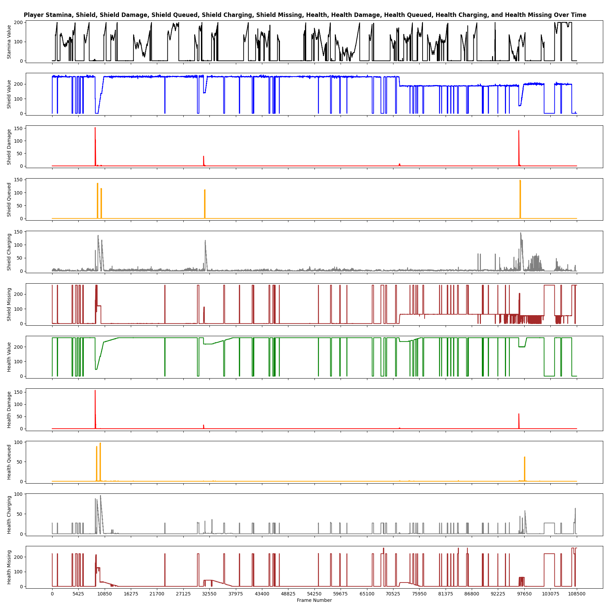
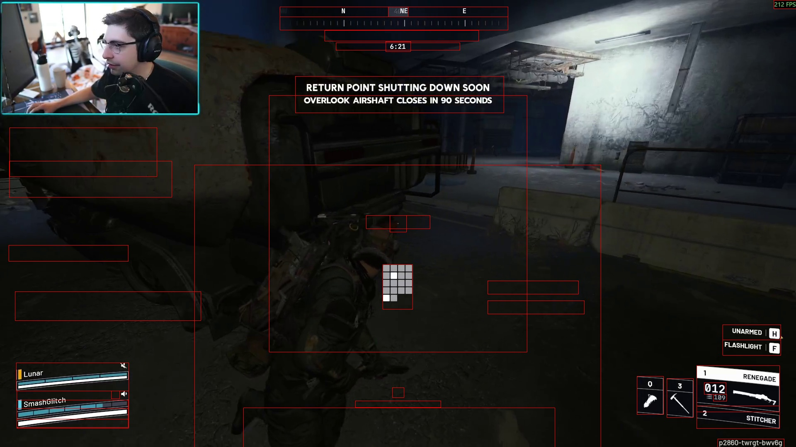
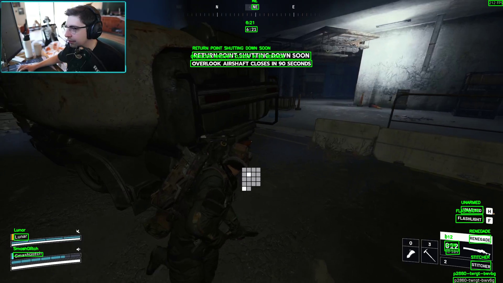
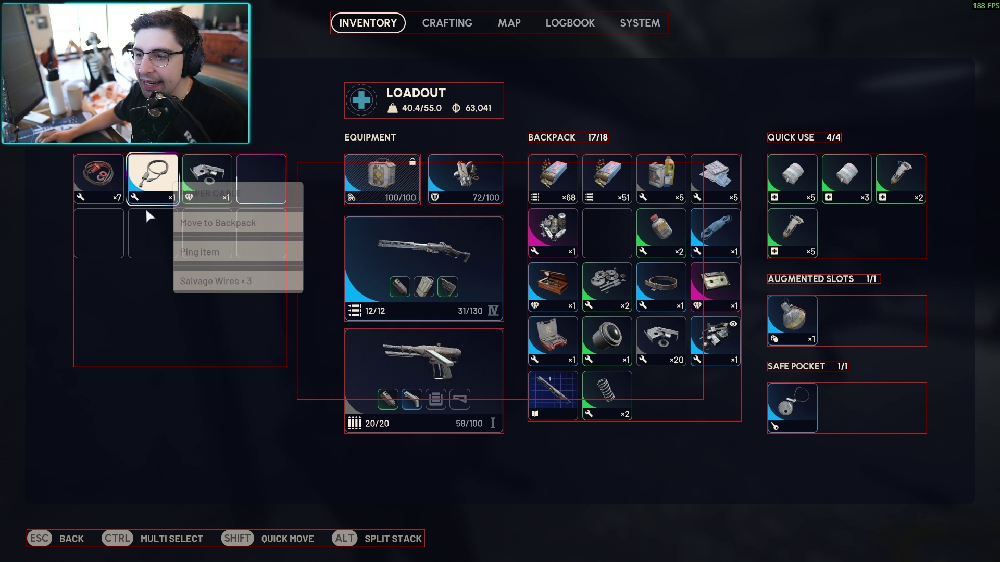
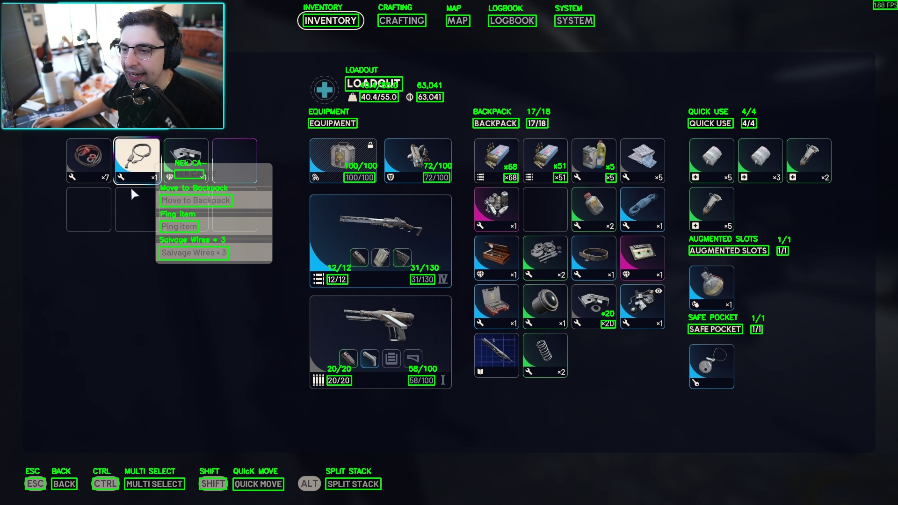
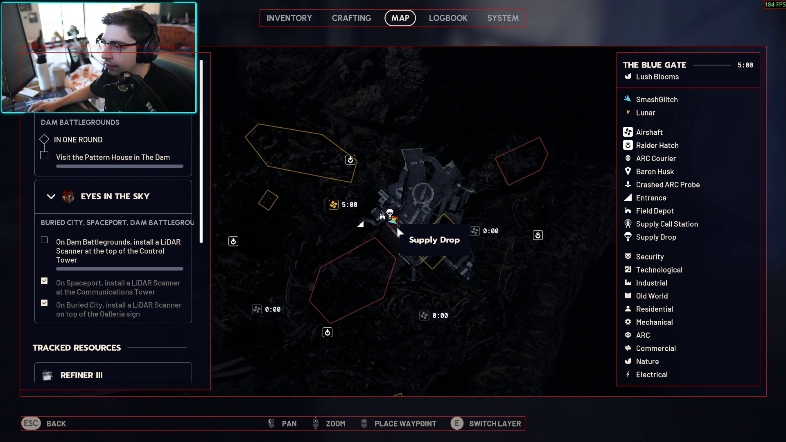
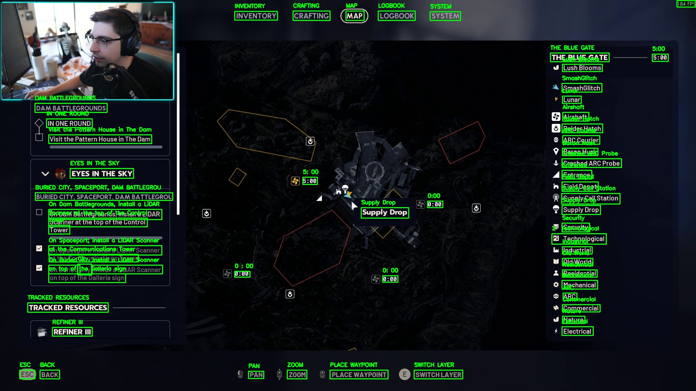
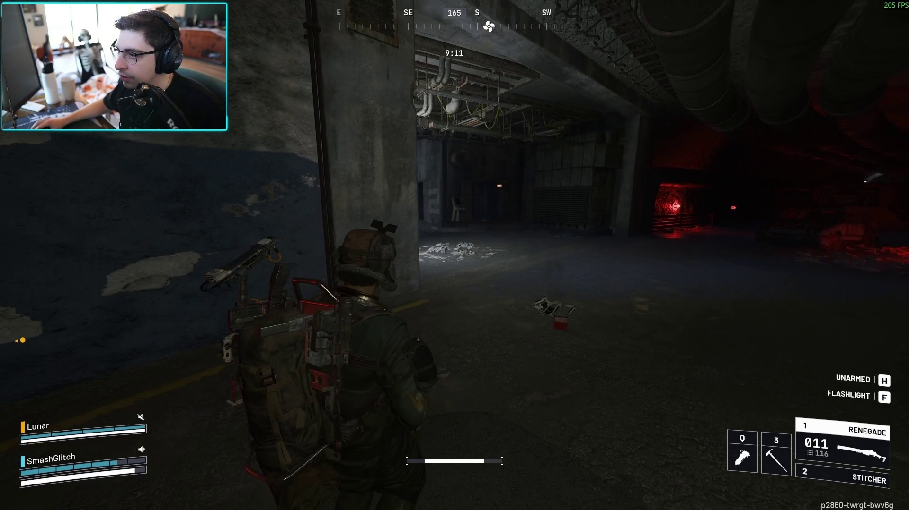
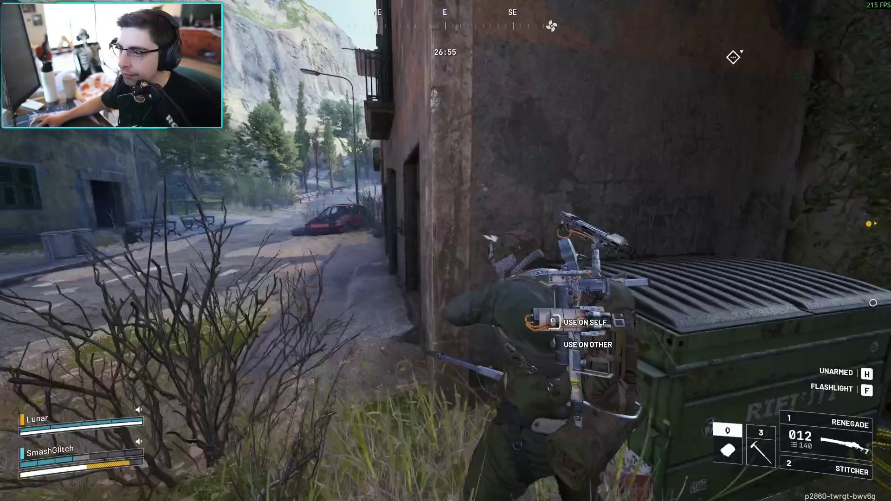
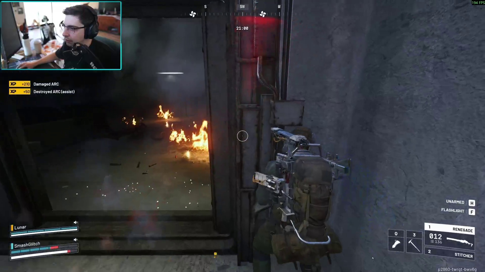

# Arc Raiders CV

This is a reboot and remaster of my previous [apexcv](https://github.com/ramity/apexcv) project.

## What?

This repo enables the downloading of twitch VODs and processing them with a combination of classical computer vision and machine learning tooling to gain additional insights into what actually happened within the video without having to manually scan the footage oneself.

## Why?

Tooling like this provides additional context that makes editing arc raiders content easier. To name a few, it helps provide answers to questions like:

- Knowing exactly what and when someone loots something
- Know every instance a player shoots, takes damage, heals, etc
- Cross reference footage from multiple sources for multiperspective edits
- Produce high resolution stats for comparing videos
- Experiment with displaying contextual information in a custom video player

## Statistics plotted

## Preview

Here is an early preview of the current regions being processed:

> In Raid UI

> Looting UI

> Map UI

## Example UI Calculations

The following stats can be calculated from the above frame:

> Stamina: XXXXXXXXXXXXXXXXXXXXXXXXXXXXXXXXXXXXXWWWWWWWWWWWWWWWWWWWWWWWWWWWWWWWWWWWWWWWWWWWWWWWWWWWWWWWWWWWWWWWWWWWWWWWWWWWWWWWWWWWWWWWWWWWWWWWWWWWWWWWWWWWWWWWWWWWWWWWWWWWWWWXXXXXXXXXXXXXXXXXXXXXXXXXXXXXXXXXXXXX
>
> White pixels in stamina bar: 126

> Shield: BBBBBBBBBBBBBBBBBBBBBBBBBBBBBBBBXBBBBBBBBBBBBBBBBBBBBBBBBBBBBBBBBBGXXBBBBBBBBBBBBBBBBBBBBBBBBBBBBBBBBBGXXBBBBBBBBBBBBBBBBBBBBBBBBBBBBBBBBBBBGXXBBBBBBBBBBBBBBBBBBBBBBBBBBBBBBBBBBBBXXBBBBBBBBBBBBBBBBGXXXXXXXXXXXXXXXXXXXXXXXXXXXXXXXXXXXXXXXXXXXXXXXXXXXXXXXXXXXXXXX
>
> Blue: 185, Red: 0, Yellow: 0, Grey: 4, Black from end: 63

> Health: WWWWWWWWWWWWWWWWWWWWWWWWWWWWWWWWWWWWWWWWWWWWWWWWWWWWWWWWWWWWWWWWWWWWWWWWWWWWWWWWWWWWWWWWWWWWWWWWWWWWWWWWWWWWWWWWWWWWWWWWWWWWWWWWWWWWWWWWWWWWWWWWWWWWWWWWWWWWWWWWWWWWWWWWWWWWWWWWWWWWWWWWWWWWWWWWWWWWWWWWWWWWWWWWWWWWWWWWWWWWWWWWWWWWWWWWWWWWWYXXXXXXXXXXXXXXXXXXXXXXX
>
> White: 237, Red: 0, Yellow: 1, Grey: 0, Black from end: 23

The following stats can be calculated from the above frame:

> Stamina: XXXXXXXXXXXXXXXXXXXXXXXXXXXXXXXXXXXXXXXXXXXXXXXXXXXXXXXXXXXXXXXXXXXXXXXXXXXXXXXXXXXXXXXXXXXXXXXXXXXXXXXXXXXXXXXXXXXXXXXXXXXXXXXXXXXXXXXXXXXXXXXXXXXXXXXXXXXXXXXXXXXXXXXXXXXXXXXXXXXXXXXXXXXXXXXXXXXXXXXX
>
> White pixels in stamina bar: 0

> Shield: BBBBBBBBBBBBBBBBBBBBBBBBBBBBBBBBXBBBBBBBBBBBBBBBBBBBBBBBBBBBBBBBBBBXXBBBBBBBBBBBBBBBBBBBBBBBBBBBBBBBBBGXXBBBBBBGGGGGGGGGGGGGGGGGGGGGGGGGGGGGXXXXXXXXXXXXXXXXXXXXXXXXXXXXXXXXXXXXXXXXXXXXXXXXXXXXXXXXXXXXXXXXXXXXXXXXXXXXXXXXXXXXXXXXXXXXXXXXXXXXXXXXXXXXXXXXXXXXXXXXX
>
> Blue: 105, Red: 0, Yellow: 0, Grey: 30, Black from end: 121

> Health: WWWWWWWWWWWWWWWWWWWWWWWWWWWWWWWWWWWWWWWWWWWWWWWWWWWWWWWWWWWWWWWWWWWWWWWWWWWWWWWWWWWWWWWWWWWWWWWWWWWWWWWWWWWWWWWWWWWWWWWWWWWWWWWWWWWWWWYYYYYYYYYYYYYYYYYYYYYYYYYYYYYYYYYYYYYYYYYYYYYYYYYYYYYYYYYYYYYYYYYYYYYYYYYYYYYYYYYYYYYYYYYYYYYYYYYXXXXXXXXXXXXXXXXXXXXXXXXXXXXXX
>
> White: 134, Red: 0, Yellow: 97, Grey: 0, Black from end: 30

The following stats can be calculated from the above frame:

> Stamina: XXXXXXXXXXXXXXXXXXXXXXXXXXXXXXXXXXXXXXXXXXXXXXXXXXXXXXXXXXXXXXXXXXXXXXXXXXXXXXXXXXXXXXXXXXXXXXXXXXXXXXXXXXXXXXXXXXXXXXXXXXXXXXXXXXXXXXXXXXXXXXXXXXXXXXXXXXXXXXXXXXXXXXXXXXXXXXXXXXXXXXXXXXXXXXXXXXXXXXXX
>
> White pixels in stamina bar: 0

> Shield: BBBBBBBBBBBBBBBBBBBBBBBBBBBBBBBBXBBBBBBBBBBBBBBBBBBBBBBBBBBBBBBBBBGXXBBBBBBBBBBBBBBBBBBBBBBBBBBBBBBBBBBXXBBBBBBBBBBBBBBBBBBBBBBBBBBBBBBBBBBBBXXBBBBGRRRRRRRRRRRRRRRRRRRRRRRRRRRRRRRXXXXXXXXXXXXXXXXXXXXXXXXXXXXXXXXXXXXXXXXXXXXXXXXXXXXXXXXXXXXXXXXXXXXXXXXXXXXXXXXXX
>
> Blue: 139, Red: 31, Yellow: 0, Grey: 2, Black from end: 82

> Health: WWWWWWWWWWWWWWWWWWWWWWWWWWWWWWWWWWWWWWWWWWWWWWWWWWWWWWWWWWWWWWWWWWWWWWWWWWWWWWWWWWWWWWWWWWWWWWWWWWWWWWWWWWWWWWWWWWWWWWWWWWWWWWWWWWWWWWWWWWWWWWWWWWWWWWWWWWWWWWWWWWWWWWWWWWWWWWWWWWWWWWWWWWWWWWWWWWWWWWWWWWWWWWWWWWWWWWWWWWGRRRRRRRRRRRXXXXXXXXXXXXXXXXXXXXXXXXXXXXXXX
>
> White: 218, Red: 11, Yellow: 0, Grey: 1, Black from end: 31

## Extraction

Use arc_raiders_scraper to scrape twitch vods by ID.

Reference https://github.com/lay295/TwitchDownloader/blob/master/TwitchDownloaderCLI/README.md#example-commands for example commands.

## Analysis

`python process-twitch-vod.py`

# Taxonomy

UI

    - Patch ID

    - End of match text

        "RETURNING TO SPERANZA"

    - In Raid

        - Compass value
            - The numerical look value if present
        - Compass bearings
            - N NE E SE S SW W NW
        - Compass bar
            - Variably contains location icons and graduations

        - Compass text
        - Match timer
        - Objective text

        - Location text

        - XP icon
        - XP value
        - XP action

        - Quickwheel
        - Team chat

        - Return bind
        - Return text
        - Return progress bar

        - Player 3 color
        - Player 3 text
        - Player 3 mic
        - Player 3 status
        - Player 3 shield
        - Player 3 health

        - Player 2 color
        - Player 2 text
        - Player 2 mic
        - Player 2 status
        - Player 2 shield
        - Player 2 health

        - Player 1 color
        - Player 1 text
        - Player 1 mic
        - Player 1 status
        - Player 1 shield
        - Player 1 health

        - Stamina bar
        - Reload prompt text
        - Reload prompt bind
        - Reloading icon

        - quick item a icon
        - quick item b icon
        - selected weapon index
        - selected weapon name
        - selected weapon quantity
        - selected weapon capacity
        - selected weapon ammo
        - selected weapon icon

        - alternative weapon index
        - alternative weapon name

        - tool tip a text
        - tool tip a bind
        - tool tip b text
        - tool tip b bind

        - 2 item name
        - 2 item quantity

        - Map tooltip text
        - Map tooltip description
        - Map tooltip bind
        - Map tooltip open map text
            - "OPEN MAP"

        - Looting

            - Inventory text
            - Map text
            - Logbook text
            - System text

            - Container text
            - Container count
            - Container capacity

    - Loading

        - Tip

        - Reloading Indicator
        - Cursor

        - Map

        - Inventory

    - Lobby

        - Resource
        - Hearts
        - Gold
        - Mail
        - Player level
        - Player name

        - Player 1 lobby leader icon
        - Player 1 name
        - Player 1 location

        (on left)
        - Player 2 name
        - Player 2 location/ready 

        (on right)
        - Player 3 name
        - Player 3 location/ready 

    - Loadout

    - Logbook

    - System

    - Map selection screen

    - Inventory

    - Traders

    - Decks

    - Store

    - Crafting

# Project Roadmap

Themes:
- Exploring faster scene recognition using scene context while being compatible with task scheduling.
- Creating compute infrastructure for arccv.py operations to schedule and scale in a celery cluster.
- Creating a frontend and backend that interact with the compute infra to provide external peers access.

Deliverables:
- Create context unaware scene detection that runs every frame. Requirements:
  1. Reliable - Reliably determine scene every frame.
  2. Lightweight - Perform as little computation as possible. Be smart everywhere else.
- Standardize frame statistics output. Version state of arccv processing.
- Modularize the code for frame eval to be scheduled in many async threads to correctly saturate compute.
- Modularize the code to be scheduled in a multi-device celery cluster.
- Create frontend that enables specifying a vod ID, start time, end time, and export options(?).
- Create frontend that displays user job in job queue with details like position, est start, duration, and end.
- Create backend that calls the scraper container to download vod ID with specified arguments.
- Create backend that performs arccv.py operations with specified video.
- Create backend that returns the computed stats json file.
- Create backend that processes statistics into a timeline file.
- Create frontend that converts VOD into timeline file.
- Create frontend that enables interacting with the stats timeline and clicking on an item shows the frame.

# Ideas For Future Work

- Context aware state machine scene detection
- Twitch Chat + LLM Side Quest
  1. Ollama or transformers LLM inside a Python container.
  2. Create a script to simulate chat using timestamped data and do some experiments using system prompted requests.
  3. Create a script that simulates the accumulation a buffer of messages over time and periodically releases it to an LLM.
  4. Use summarizer to summarize streams and create a hierarchy/pyramid of summaries.
  5. Create an interview question process.
