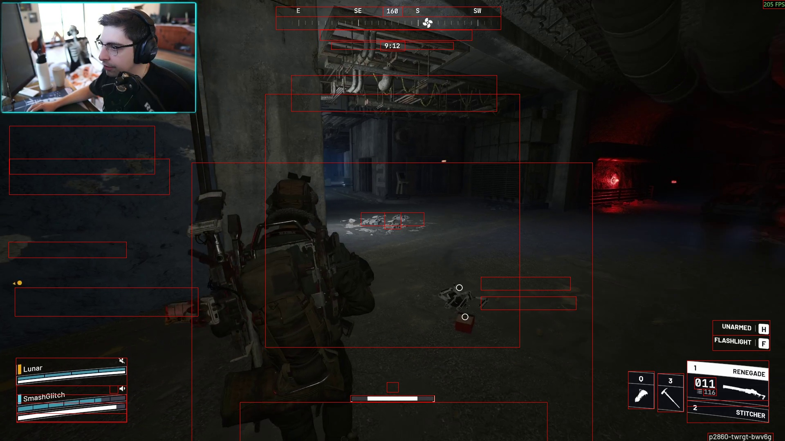

# Arc Raiders CV

An early preview on the current regions being processed:

> In Raid UI

> Looting UI

> Map UI

# Overview

## Extraction

Use arc_raiders_scraper to scrape twitch vods by ID.

Reference https://github.com/lay295/TwitchDownloader/blob/master/TwitchDownloaderCLI/README.md#example-commands for example commands.

## Analysis

`python process-twitch-vod.py`

## Twitch Chat + LLM Side Quest

Ollama + Python container

Create a script to simulate chat using timestamped data and do some experiments using system prompted requests

Create a script that simulates the accumulation a buffer of messages over time and periodically releases it to an LLM

# Taxonomy

UI

    - Patch ID

    - End of match text

        "RETURNING TO SPERANZA"

    - In Raid

        - Compass value
            - The numerical look value if present
        - Compass bearings
            - N NE E SE S SW W NW
        - Compass bar
            - Variably contains location icons and graduations

        - Compass text
        - Match timer
        - Objective text

        - Location text

        - XP icon
        - XP value
        - XP action

        - Quickwheel
        - Team chat

        - Return bind
        - Return text
        - Return progress bar

        - Player 3 color
        - Player 3 text
        - Player 3 mic
        - Player 3 status
        - Player 3 shield
        - Player 3 health

        - Player 2 color
        - Player 2 text
        - Player 2 mic
        - Player 2 status
        - Player 2 shield
        - Player 2 health

        - Player 1 color
        - Player 1 text
        - Player 1 mic
        - Player 1 status
        - Player 1 shield
        - Player 1 health

        - Stamina bar
        - Reload prompt text
        - Reload prompt bind
        - Reloading icon

        - quick item a icon
        - quick item b icon
        - selected weapon index
        - selected weapon name
        - selected weapon quantity
        - selected weapon capacity
        - selected weapon ammo
        - selected weapon icon

        - alternative weapon index
        - alternative weapon name

        - tool tip a text
        - tool tip a bind
        - tool tip b text
        - tool tip b bind

        - 2 item name
        - 2 item quantity

        - Map tooltip text
        - Map tooltip description
        - Map tooltip bind
        - Map tooltip open map text
            - "OPEN MAP"

        - Looting

            - Inventory text
            - Map text
            - Logbook text
            - System text

            - Container text
            - Container count
            - Container capacity

    - Loading

        - Tip

        - Reloading Indicator
        - Cursor

        - Map

        - Inventory

    - Lobby

        - Resource
        - Hearts
        - Gold
        - Mail
        - Player level
        - Player name

        - Player 1 lobby leader icon
        - Player 1 name
        - Player 1 location

        (on left)
        - Player 2 name
        - Player 2 location/ready 

        (on right)
        - Player 3 name
        - Player 3 location/ready 

    - Loadout

    - Logbook

    - System

    - Map selection screen

    - Inventory

    - Traders

    - Decks

    - Store

    - Crafting

# Scene state machine

